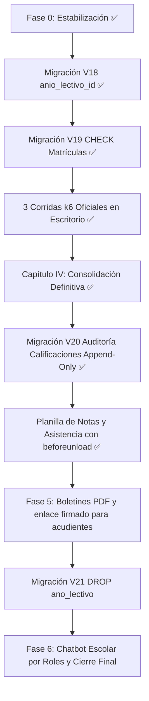

# Auditoría Integral SIGA-IEA — Estado Real del Código y Hoja de Ruta

> Fecha de actualización: 2026-10-01  
> Fuente: Revisión directa del árbol de trabajo en `d:/PA7` (`feature/back`), 20 migraciones Flyway (`V1` a `V20`), 16 paquetes Java, scripts k6 actualizados (`scripts/k6/load-test-asistencias.js`) y suite de pruebas.

---

## 1. Estado de la Suite de Pruebas

| Suite | Tests / Invocaciones | Estado | Observación |
|---|---|---|---|
| `CursoTest` | 26 (param.) | ✅ | Catálogo cerrado `GradoAcademico`, normalización y validación estricta |
| `CursoViewRenderTest` | 10 | ✅ | Renderizado y filtros de cursos |
| `HorarioFlexibleTest` | 11 | ✅ | Validación de colisiones y `HorarioValidator` |
| `SalonBloqueTest` | 2 | ✅ | Catálogos de salones y bloques |
| `AnioLectivoPeriodoTest` | 2 | ✅ | Ciclo lectivo y periodos |
| `ConfiguracionParametrosViewTest` | 4 | ✅ | Parámetros del sistema |
| `EscalaDesempenoServiceTest` | 1 | ✅ | Escala valorativa (incluye Desempeño Crítico) |
| `MatriculaCursoSincronizacionTest` | 3 | ✅ | Sincronización matrícula -> CursoEstudiante |
| `StorageServiceTest` | 14 | ✅ | Carga y gestión documental MinIO |
| `AcudienteServiceTest` | 2 | ✅ | Gestión de acudientes |
| `EstudianteAcudienteTest` | 2 | ✅ | Relación N:M estudiante-acudiente |
| `EstudianteServiceTest` | 3 | ✅ | Lógica de estudiantes |
| `PersonalYEstudiantesFilterViewTest` | 4 | ✅ | Filtros de personal y estudiantes |
| `UsuarioServiceTest` | 5 | ✅ | Gestión de usuarios y credenciales |
| `AsistenciaServiceTest` | 12 | ✅ | Flujos transaccionales de asistencia |
| `MiJornadaControllerTest` | 8 | ✅ | Endpoints HTMX de Mi Jornada |
| `SigaIeaApplicationTests` | 1 | ✅ | Smoke test de contexto Spring Boot |
| **Subtotal Funcional (In-Memory)** | **110** | **✅ PASAN** | **84 métodos convencionales + 26 parametrizados (`BUILD SUCCESS` en `mvn test`)** |
| `PostgresRepositoryTest` | 9 | ✅ PASAN | Integra FK compuesta V18, unicidad V18, asignación/propagación, CHECK V19, ausencia de nulos y auditoría append-only V20 (`-Pintegration`) |
| **Total General** | **119** | **✅ PASAN** | **Aislamiento por defecto en `pom.xml`; ejecutable con `-Pintegration` o `-Dgroups=integration`** |

---

## 2. Pruebas de Carga (k6) — Campaña Definitiva en Escritorio y Línea Base Preliminar

### 2.1 Campaña Definitiva Oficial (Entorno de Escritorio — V20, PostgreSQL 18.3, Ryzen 7 5700G)
- **Fecha Dinámica**: `2026-10-01` (día hábil jueves, validando ventana de edición docente en caliente).
- **Corridas Ejecutadas**: 3 corridas independientes oficiales tras descartar la corrida de calentamiento. Saneamiento de `asistencias` y `sesiones_clase` entre corridas.
- **Archivos JSON Generados**: [`summary_run1.json`](file:///d:/PA7/scripts/k6/summary_run1.json), [`summary_run2.json`](file:///d:/PA7/scripts/k6/summary_run2.json), [`summary_run3.json`](file:///d:/PA7/scripts/k6/summary_run3.json).
- **Solicitudes Totales**: 2.253 solicitudes HTTP procesadas (750 a 752 reqs/corrida a ~12.7 req/s).
- **Tasa de Fallo Observada**: 0.00% en Corrida 1 y 2; 0.13% en Corrida 3 (1 fallo en 2.253 reqs = 0.044%, < 1.0%). Causa de la falla en corrida 3 no determinada en el log (posible contención en adquisición de conexiones o concurrencia de upsert no atómico).
- **Tasa de Éxito Observada Global**: 99.95% (2.252 solicitudes exitosas de 2.253). En persistencia masiva: 99.29% (140 de 141 transacciones exitosas).
- **Efectividad en Checks**: 3.646 aserciones aprobadas de 3.648 (99.95%).
- **Integridad Relacional**: 3 de 3 sesiones creadas por corrida sin duplicados (`ead2db28-643e-4d88-bf95-19a7cfdcd9e2`).

| Métrica / Escenario Evaluado | Corrida 1 (mín/med/**p95**/máx) | Corrida 2 (mín/med/**p95**/máx) | Corrida 3 (mín/med/**p95**/máx) | Rango p95 Definitivo | Umbral | Cumplimiento |
|---|---|---|---|:---:|:---:|:---:|
| **Lectura Mapa (40 est.)** | 8.00 / 12.00 / **19.00** / 27.00 ms | 9.00 / 13.00 / **23.00** / 32.00 ms | 9.00 / 12.00 / **15.70** / 35.00 ms | **[15.70 - 23.00] ms** | < 300 ms | ✅ Cumple |
| **Escritura Masiva (40 est.)** | 53.00 / 64.00 / **94.10** / 132.00 ms | 57.00 / 69.00 / **96.25** / 128.00 ms | 52.00 / 62.00 / **89.00** / 104.00 ms | **[89.00 - 96.25] ms** | < 500 ms | ✅ Cumple |
| **Colisión Concurrente Batch** | *Ráfaga*: **32.00 ms** | *Ráfaga*: **32.00 ms** | *Ráfaga*: **26.00 ms** | **[26.00 - 32.00] ms** | < 500 ms | ✅ Cumple |
| **Idempotencia `abrirDia`** | 12.00 / 17.00 / **22.05** / 25.00 ms | 12.00 / 18.00 / **22.05** / 23.00 ms | 13.00 / 16.00 / **19.00** / 20.00 ms | **[19.00 - 22.05] ms** | < 300 ms | ✅ Cumple |
| **Duración Global Peticiones** | 0.96 / 13.18 / **156.48** / 240.05 ms | 1.30 / 14.79 / **150.90** / 198.66 ms | 0.94 / 12.56 / **154.82** / 210.64 ms | **[150.90 - 156.48] ms** | < 300 ms | ✅ Cumple |

### 2.2 Línea Base Preliminar de Referencia (Portátil i7-1165G7 — Esquema V17, PostgreSQL 16.15)
- **Función**: Antecedente exploratorio previo a la optimización de V18/V19. Preservado en [`scripts/k6/summary_baseline_v17_laptop.json`](file:///d:/PA7/scripts/k6/summary_baseline_v17_laptop.json).
- **Métricas V17 Portátil**: Lectura p95: 94.10 ms | Escritura p95: 251.00 ms | Contención p95: 159.65 ms | Global p95: 191.02 ms | Latencia media global: 78.51 ms.
- **Advertencia de no comparabilidad**: Diferencias simultáneas de procesador (4c vs 8c), motor (PG 16 vs 18), perfiles de k6 y fechas impiden atribuir la variación exclusivamente a la arquitectura de software.

---

## 3. Decisiones Arquitectónicas Confirmadas

1. **Acudientes como Contactos Notificables (Sin Rol de Login)**:
   - Se descarta crear el rol `ACUDIENTE` en el subsistema de autenticación.
   - La entrega de boletines e informes se realizará mediante **enlaces firmados de un solo uso** enviados al correo electrónico registrado.
   - Toda recolección y tratamiento de datos de acudientes y menores se rige por el consentimiento informado según la **Ley Estatutaria 1581 de 2012**.
   - La relación se modela en `estudiante_acudiente` (N:M con indicación de acudiente principal y parentesco).

2. **Catálogo Cerrado de Grados (`GradoAcademico`)**:
   - Implementado como enum cerrado (`TRANSICION`, `PRIMERO` ... `ONCE`).
   - Se eliminó el default silencioso a `"11°"`: cualquier valor fuera de catálogo lanza `IllegalArgumentException`.
   - Se incluyó `"Transición"` en el modal de creación de cursos [`modal-curso.html`](file:///d:/PA7/src/main/resources/templates/clases/fragments/modal-curso.html).

3. **Fuente Única de Salones y Docentes en Horarios**:
   - El salón de la clase proviene estrictamente de `Horario.salonEntidad` (FK a `salones`). Se eliminó toda lectura de `h.getSalon()`.
   - El docente asignado a la asignatura proviene estrictamente de `CursoMateria`. `Horario.docente` se mantiene únicamente con `@Deprecated` para compatibilidad transitoria.

---

## 4. Estado de Deudas Técnicas y Plan de Migraciones

Para permitir reversibilidad granular y evitar acoplamiento, el esquema de BD se divide en migraciones separadas:

### 4.1 Migración V18: Integridad del Año Lectivo — ✅ APLICADA Y VERIFICADA
- **Estado**: Aplicada en `siga` y `siga_test` (checksum validado en `flyway_schema_history`).
- **Logros Alcanzados**:
  1. Vinculación formal de `anio_lectivo_id UUID REFERENCES anios_lectivos(id)` en `cursos`, `curso_materia`, `curso_estudiante` y `matriculas`.
  2. Implementación de clave foránea compuesta `fk_curso_materia_curso_anio` que impide desfases temporales entre un curso y sus materias asignadas.
  3. Restricciones UNIQUE `(estudiante_id, anio_lectivo_id)` en `matriculas` y `curso_estudiante`.
  4. **Registro de Saneamiento**: 3 filas de prueba en estado `PENDIENTE_DE_REVISION` que apuntaban a cursos de 2027 siendo de 2026 fueron saneadas con `curso_id = NULL`.
  5. Derivación estrictamente unidireccional: `anoLectivo` String se calcula desde `anioLectivo.getAnio()`.

### 4.2 Migración V19: Restricción Condicional en Matrículas — ✅ APLICADA Y VERIFICADA
- **Estado**: Aplicada en `siga` y `siga_test`.
- **Logros Alcanzados**:
  1. Restricción `chk_matricula_curso_aprobada` agregada mediante `CHECK (estado <> 'APROBADA' OR curso_id IS NOT NULL)`.
  2. Probada y verificada en `PostgresRepositoryTest`: rechaza actualizaciones a `APROBADA` sin curso asignado, pero permite creación y persistencia de matrículas en revisión con `curso_id` nulo.

### 4.3 Migración V20: Auditoría Append-Only de Calificaciones — ✅ APLICADA Y VERIFICADA
- **Estado**: Aplicada en `siga` y `siga_test`.
- **Logros Alcanzados**:
  1. Creación de la tabla `auditoria_cambios` con índices en `(entidad, entidad_id)` y `fecha`.
  2. Integridad física a nivel de motor: trigger PostgreSQL `trg_auditoria_cambios_bloquear_modificacion` (`BEFORE UPDATE OR DELETE ON auditoria_cambios FOR EACH ROW`) bloquea explícitamente operaciones UPDATE y DELETE (append-only estricto).
  3. **Comportamiento ante TRUNCATE y Manejo de Errores**: Al ser un trigger a nivel de fila (`FOR EACH ROW`), no intercepta sentencias `TRUNCATE` (operación DDL de tabla completa), lo cual permite que las pruebas automatizadas de integración limpien `siga_test` entre suites sin error. En producción, la seguridad física contra eliminación de tabla se complementa mediante la revocación del privilegio `TRUNCATE` al rol de conexión de la aplicación web. Cualquier subsanación de auditoría debe realizarse obligatoriamente mediante **registros compensatorios** (nuevas filas de auditoría que documenten el ajuste).
  4. Implementación de `AuditoriaService.registrarCambio(...)` con propagación `REQUIRED` atómica para evitar registros huérfanos ante rollbacks, ejecutándose dentro del contexto transaccional de `CalificacionesService.registrarONota`.
  5. Integración en `CalificacionesService.registrarONota`: detección y auditoría automática ante variaciones de notas, registrando usuario autenticado.
  6. Probada y verificada exhaustivamente mediante `PostgresRepositoryTest.testPostgresV20AuditoriaCambioCalificacion()`.

### 4.4 Migración V21: Desacoplamiento Definitivo de anoLectivo (Proyectada)
- **Objetivo**: `ALTER TABLE ... DROP COLUMN ano_lectivo` en `cursos`, `curso_materia`, `curso_estudiante` y `matriculas`, consolidando a `anio_lectivo_id` como la única fuente de verdad en el modelo de persistencia y de dominio.

---

## 5. Pendientes Técnicos Específicos

1. **Protección `beforeunload` con HTMX**:
   - ✅ **COMPLETADO**: Implementado en [`clases-detalle.js`](file:///d:/PA7/src/main/resources/static/js/clases-detalle.js) (planilla de notas) y en [`mi-jornada/fragments.html`](file:///d:/PA7/src/main/resources/templates/mi-jornada/fragments.html) (toma docente de asistencia) con desvinculación limpia en `htmx:beforeCleanupElement` para prevenir memory leaks.
2. **Validación en Base de Datos en Test de Seguridad**:
   - ✅ **COMPLETADO**: Verificado en [`MiJornadaControllerTest.java`](file:///d:/PA7/src/test/java/com/siga/siga_iea/asistencias/MiJornadaControllerTest.java), comprobando que tras un intento no autorizado (403), `asistenciaRepository.findBySesionId(...)` contiene exactamente 0 registros.
3. **Migración a Testcontainers**:
   - Proyectada para CI/CD automatizado, reemplazando la dependencia del puerto local 5433 en `PostgresRepositoryTest` por un contenedor efímero gestionado por Testcontainers (`@Container PostgreSQLContainer<?>`).
4. **Saneamiento del Capítulo IV**:
   - ✅ **COMPLETADO**: Capítulo IV consolidado con la campaña definitiva de 3 corridas en escritorio (p95 lectura [15.70 - 23.00] ms, escritura [89.00 - 96.25] ms, ráfaga colisión batch [26.00 - 32.00] ms, contención [19.00 - 22.05] ms); diferenciada la plataforma de escritorio (Ryzen 7 5700G, PG 18.3) de la línea base exploratoria del portátil (i7, PG 16.15); inventario formalizado en 119 pruebas automatizadas (110 H2 + 9 PostgreSQL); chatbot formalmente reportado como no implementado en la versión evaluada (0 líneas de código en el árbol del proyecto).

---

## 6. Hoja de Ruta Priorizada

