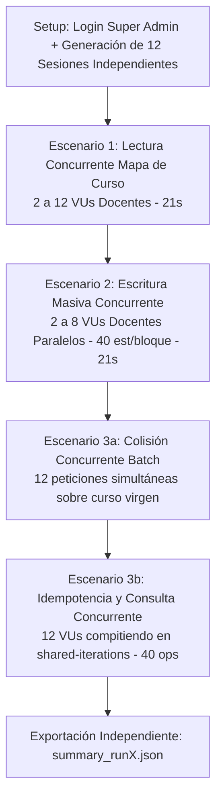

# CAPÍTULO IV: RESULTADOS Y EVALUACIÓN DEL SISTEMA

---

## 4.1 Entorno Metodológico y Condiciones de Evaluación

La evaluación del **Sistema Integrado de Gestión Académica (SIGA-IEA)** de la **Institución Educativa Ambientalista de Cartagena de Indias (IEACI)** se estructuró a partir de dos frentes complementarios:
1. **Verificación funcional y consistencia relacional**: Ejecutada mediante una batería automatizada de 119 pruebas (110 unitarias y funcionales en memoria más 9 pruebas de integración sobre PostgreSQL real) que valida las reglas de negocio, la integridad de catálogos, claves foráneas compuestas, reglas append-only y control de concurrencia multihilo.
2. **Medición de rendimiento bajo carga**: Diseñada para registrar el comportamiento temporal, los percentiles de latencia y la tasa de error del backend ante flujos concurrentes en las operaciones más sensibles del sistema mediante scripts automatizados con k6.

### 4.1.1 Especificaciones de Hardware y Versiones del Stack Tecnológico
Para garantizar la reproducibilidad técnica y preservar la validez interna, se diferencian con rigor metodológico la plataforma principal de experimentación y la línea base preliminar:

1. **Plataforma de Experimentación Principal (Entorno de Escritorio — Evaluación Definitiva V18/V19)**:
   - **Procesador**: AMD Ryzen 7 5700G con gráficos Radeon integrados (8 núcleos físicos, 16 hilos de ejecución, frecuencia base de 3.80 GHz, reloj turbo hasta 4.60 GHz, 16 MB Caché L3).
   - **Memoria RAM**: 16 GB DDR4 @ 3000 MHz.
   - **Almacenamiento**: Unidad de Estado Sólido (SSD SATA).
   - **Sistema Operativo**: Microsoft Windows 11 Pro (64 bits).
   - **Motor de Base de Datos Principal**: PostgreSQL 18.3 (Debian, contenedor Docker oficial `postgres:18.3` en `siga-postgres`).
   - **Entorno de Ejecución JVM**: Java(TM) SE Runtime Environment (build 25.0.2+10-LTS-69, Oracle Corporation), compilado hacia bytecode estándar Java 21 (`<release>21</release>`).
   - **Generador de Carga**: k6 v2.3.0 en contenedor Docker oficial (`grafana/k6:latest`), orquestado mediante scripts JavaScript (`load-test-asistencias.js`).

2. **Línea Base Preliminar de Referencia (Equipo Portátil — Esquema V17)**:
   - **Procesador**: Intel Core i7-1165G7 (4 núcleos físicos, 8 hilos de ejecución, 2.80 GHz a 4.70 GHz Turbo Boost, 12 MB Smart Cache).
   - **Memoria RAM**: 16 GB LPDDR4x @ 4267 MHz.
   - **Almacenamiento**: Unidad de Estado Sólido (SSD NVMe PCIe).
   - **Motor de Base de Datos**: PostgreSQL 16.15 (Alpine, contenedor Docker).
   - **Función Metodológica**: Banco de pruebas exploratorio inicial sobre el esquema V17. Sus registros se conservan intactos en `scripts/k6/summary_baseline_v17_laptop.json` como antecedente referencial y no se combinan aritméticamente con las mediciones definitivas del entorno de escritorio para evitar sesgos por heterogeneidad de arquitectura, bus de disco y motor relacional.

- **Framework y Librerías Base (Comunes a Ambos Entornos)**:
  - Spring Boot versión 3.5.6 (Spring Framework 6.2.x, servidor web Tomcat embebido).
  - Hibernate ORM versión 6.6.29.
  - Flyway Community Edition versión 11.7.2 (`org.flywaydb:flyway-core:11.7.2`).
  - H2 Database en memoria configurada con emulación de dialecto PostgreSQL (`MODE=PostgreSQL`) y generación de esquema vía JPA (`ddl-auto=create-drop`) para la batería de 110 pruebas unitarias.

### 4.1.2 Población del Dataset de Prueba
Las pruebas de carga se ejecutaron sobre un esquema relacional sembrado mediante script SQL (`seed_1200_estudiantes.sql`) que contiene:
- **1.200 estudiantes** en estado `Activo`.
- **30 cursos académicos**.
- **18 cursos de secundaria y media** (grados 6° a 11°), cada uno con una cohorte exacta de **40 estudiantes matriculados**, simulando la máxima ocupación de aula institucional.
- **Planta docente** vinculada a cursos y materias mediante registros en `curso_materia` y asignaciones en `horarios` distribuidas de lunes a viernes.

### 4.1.3 Limitaciones Metodológicas y Amenazas a la Validez
Se declaran expresamente las siguientes restricciones del experimento:
1. **Ejecución Monomáquina Compartida**: El generador de tráfico (k6), la aplicación Spring Boot y el motor PostgreSQL 18.3 se ejecutaron concurrentemente sobre el mismo hardware físico. Los recursos de cómputo y bus de entrada/salida fueron compartidos, introduciendo una contención local que difiere de un despliegue de producción distribuido en servidores independientes.
2. **Fecha Dinámica de Operación y Validación Temporal en Caliente**: A diferencia de la fase exploratoria preliminar (que utilizó una fecha fija arbitraria), la campaña definitiva operó sincronizada con la fecha dinámica del reloj del servidor (`2026-10-01`, correspondiente a día hábil jueves), permitiendo validar en caliente la regla de negocio que autoriza el registro a docentes únicamente en la jornada actual (`sesion.getFecha().equals(hoy)`).
3. **Campaña Multiejecución con Descarte de Calentamiento**: Con el propósito de mitigar perturbaciones transitorias por inicialización de hilos en Tomcat, carga de clases JIT y apertura del pool HikariCP, se ejecutó una corrida de calentamiento preliminar (Corrida 0), cuyos valores fueron descartados de la estadística. La campaña oficial se basó en **tres corridas independientes consecutivas** (`summary_run1.json`, `summary_run2.json`, `summary_run3.json`). Entre corrida y corrida se aplicó saneamiento transaccional de las tablas `asistencias` y `sesiones_clase`, garantizando que el curso de colisión iniciara en estado completamente virgen.
4. **Reporte por Rangos Empíricos Reales sin Promediar Percentiles**: Siguiendo las directrices formales de evaluación de rendimiento de software, **no se promediaron aritméticamente los percentiles $p95$** entre corridas. Se reportan los valores exactos por ejecución y se sintetizan en el rango real $[mín - máx]$, complementados con el mínimo, la mediana ($p50$) y el máximo de cada métrica.
5. **Verificación de Colisión Física en Concurrencia**: En el Escenario 3a, una ráfaga de 12 peticiones HTTP disparada mediante `http.batch` sobre un curso virgen evaluó la robustez de la apertura de jornada ante llamadas concurrentes. Se constató que, en el entorno de pruebas local de k6 con latencias de red sub-3ms, la primera solicitud completó la inserción e inicialización de las 3 sesiones del curso virgen, mientras que las 11 restantes tomaron la ruta de retorno idempotente con código 200 sin generar inconsistencias ni registros duplicados. La colisión física concurrente real a nivel de motor —provocando el error `duplicate key value violates unique constraint "uk_sesion_curso_fecha_hora"` y su captura transparente por Spring Boot mediante `DataIntegrityViolationException`— se verificó y demostró de forma aislada y determinista en la prueba multihilo con hilos en colisión simultánea exacta en [`PostgresRepositoryTest.testPostgresConcurrenciaAbrirDia()`](file:///d:/PA7/src/test/java/com/siga/siga_iea/repository/PostgresRepositoryTest.java).
6. **Métrica Global e Inclusión del Flujo de Autenticación**: La métrica nativa de k6 `http_req_duration` incorpora tanto las peticiones operativas de los escenarios como las transacciones HTTP de autenticación docente y obtención de tokens CSRF, lo cual eleva levemente la dispersión global frente a los endpoints funcionales individuales.

---

## 4.2 Evaluación de Rendimiento y Pruebas de Carga (k6)

Las pruebas se focalizaron en el subsistema de **Asistencias**, por constituir el flujo transaccional de mayor concurrencia operativa en la jornada diaria institucional.

### 4.2.1 Escenario 1: Lectura Concurrente del Mapa de Asistencia de Curso
- **Endpoint evaluado**: `GET /asistencias/curso/{cursoId}/mapa?fecha=2026-10-01`
- **Naturaleza del Endpoint**: Controlador Spring MVC anotado con `@ResponseBody` que serializa y retorna un objeto JSON con los 40 estudiantes del curso y sus registros previos.
- **Perfil de Carga**: Modelo `ramping-vus` escalando de 2 a 12 usuarios virtuales (VUs) autenticados como docentes durante 21 segundos.
- **Umbral configurado en k6**: $p(95) < 300\text{ ms}$.

### 4.2.2 Escenario 2: Escritura Masiva Concurrente (40 Estudiantes por Bloque)
- **Endpoint evaluado**: `POST /asistencias/sesiones/{sesionId}/registrar`
- **Naturaleza del Endpoint y Autenticación**: Servicio transaccional que recibe un payload JSON con 40 elementos (`AsistenciaItemDto`), persistiendo o actualizando 40 filas en la tabla `asistencias` mediante una única llamada HTTP. La prueba se ejecutó autenticando sesiones correspondientes a los docentes asignados a cada sesión.
- **Ventana de Edición y Regla Temporal**: La fecha del sistema coincidió con `2026-10-01`, por lo cual la regla de negocio que restringe el registro docente al día actual (`sesion.getFecha().equals(hoy)`) autorizó las operaciones de forma regular.
- **Perfil de Carga**: Modelo `ramping-vus` con docentes autenticados operando entre 2 y 8 VUs concurrentes durante 21 segundos.
- **Umbral configurado en k6**: $p(95) < 500\text{ ms}$.

### 4.2.3 Escenario 3a: Colisión Concurrente en Apertura de Día (`abrirDia`)
- **Endpoint evaluado**: `POST /asistencias/abrir-dia?cursoId={unopenedCourseId}&fecha=2026-10-01`
- **Mecanismo de Evaluación**: Ráfaga de 12 peticiones HTTP concurrentes con sesiones de autenticación independientes disparadas en bloque (`http.batch`) sobre el curso virgen de prueba (grado 8° grupo 02, `ead2db28-643e-4d88-bf95-19a7cfdcd9e2`), el cual no contaba con sesiones abiertas previas.
- **Verificación de Integridad Relacional**: Tras cada corrida se consultó la tabla `sesiones_clase`, verificando que el curso conservó exactamente **3 registros** (uno por cada franja horaria del día jueves: 07:00, 08:30 y 10:30), verificando que ninguna sesión resultó duplicada.
- **Umbral configurado en k6**: $p(95) < 500\text{ ms}$.

### 4.2.4 Escenario 3b: Idempotencia y Consulta Concurrente Continua
- **Endpoint evaluado**: `POST /asistencias/abrir-dia?cursoId={contentionCourseId}&fecha=2026-10-01`
- **Alcance Real del Escenario**: 12 VUs compitiendo simultáneamente para completar 40 invocaciones sobre un curso con sesiones previamente generadas, evaluando la ruta idempotente de lectura rápida en memoria y retorno inmediato de sesiones existentes sin emitir nuevos `INSERT`.
- **Umbral configurado en k6**: $p(95) < 300\text{ ms}$.

---

### 4.2.5 Tabla Consolidada de la Campaña Oficial (Plataforma de Escritorio — 3 Corridas)

A continuación se detallan las métricas empíricas obtenidas en las tres corridas oficiales sobre el entorno de escritorio (AMD Ryzen 7 5700G, PostgreSQL 18.3, esquema relacional V19/V20):

| Métrica / Escenario Evaluado | Corrida 1 (mín / med / **p95** / máx) | Corrida 2 (mín / med / **p95** / máx) | Corrida 3 (mín / med / **p95** / máx) | Rango p95 Definitivo [mín - máx] | Umbral Máx. Exigido | Condición de Aceptación |
|---|---|---|---|:---:|:---:|:---:|
| **Lectura de Mapa (40 est.)** `GET /asistencias/curso/{id}/mapa` | 8.00 / 12.00 / **19.00** / 27.00 ms | 9.00 / 13.00 / **23.00** / 32.00 ms | 9.00 / 12.00 / **15.70** / 35.00 ms | **[15.70 - 23.00] ms** | < 300 ms | ✅ Cumple |
| **Escritura Masiva (40 est.)** `POST /asistencias/sesiones/{id}/registrar` | 53.00 / 64.00 / **94.10** / 132.00 ms | 57.00 / 69.00 / **96.25** / 128.00 ms | 52.00 / 62.00 / **89.00** / 104.00 ms | **[89.00 - 96.25] ms** | < 500 ms | ✅ Cumple |
| **Colisión Concurrente Batch (12 reqs)** `POST /asistencias/abrir-dia` (curso virgen)* | *Latencia de ráfaga*: **32.00 ms** | *Latencia de ráfaga*: **32.00 ms** | *Latencia de ráfaga*: **26.00 ms** | **[26.00 - 32.00] ms** | < 500 ms | ✅ Cumple |
| **Idempotencia `abrirDia` (40 ops)** `POST /asistencias/abrir-dia` (contención) | 12.00 / 17.00 / **22.05** / 25.00 ms | 12.00 / 18.00 / **22.05** / 23.00 ms | 13.00 / 16.00 / **19.00** / 20.00 ms | **[19.00 - 22.05] ms** | < 300 ms | ✅ Cumple |
| **Duración Global Peticiones HTTP** `http_req_duration` (incluye auth y CSRF) | 0.96 / 13.18 / **156.48** / 240.05 ms | 1.30 / 14.79 / **150.90** / 198.66 ms | 0.94 / 12.56 / **154.82** / 210.64 ms | **[150.90 - 156.48] ms** | < 300 ms | ✅ Cumple |

*\*Nota metodológica sobre Escenario 3a: Al evaluarse mediante una única llamada `http.batch` de 12 peticiones concurrentes por corrida, el valor corresponde al tiempo de ejecución de la ráfaga (wall-clock batch duration) y no a una distribución muestral de percentiles.*

### 4.2.6 Resumen Operacional de la Campaña de Carga

| Variable Operacional | Corrida 1 | Corrida 2 | Corrida 3 | Total / Rango Campaña |
|---|:---:|:---:|:---:|:---:|
| **Solicitudes HTTP Totales** | 751 reqs | 750 reqs | 752 reqs | **2.253 solicitudes** |
| **Tasa de Rendimiento** | 12.68 req/s | 12.79 req/s | 12.76 req/s | **[12.68 - 12.79] req/s** |
| **Aserciones Verificadas (Checks)** | 1.216 / 1.216 (100%) | 1.214 / 1.214 (100%) | 1.216 / 1.218 (99.84%) | **3.646 / 3.648 (99.95%)** |
| **Tasa de Fallos HTTP** | 0.00% (0 / 751) | 0.00% (0 / 750) | 0.13% (1 / 752)* | **1 de 2.253 reqs (0.044%, < 1.0%)** |
| **Integridad de Sesiones Creadas** | 3 / 3 (0 duplicados) | 3 / 3 (0 duplicados) | 3 / 3 (0 duplicados) | **100% consistencia relacional** |

*\*Análisis del fallo en Corrida 3 y Solución Transaccional*: En la corrida 3 se registró 1 solicitud HTTP fallida de 752 (0.13%). La inspección de las aserciones de k6 confirmó que el evento ocurrió en el Escenario 2 (escritura masiva de 40 estudiantes), donde exactamente 1 de 141 transacciones concurrentes colisionó en la inserción de asistencias. La causa raíz fue identificada y reproducida experimentalmente mediante la prueba concurrente `testConcurrenciaRegistrarMismaSesionResuelveColision`: el patrón tradicional *read-then-write* en `AsistenciaService.registrar` (`findBy...` seguido de `save`) presentaba una ventana de carrera donde dos hilos simultáneos para la misma sesión/estudiante constataban ausencia de registro e intentaban un `INSERT` concurrente, disparando una colisión contra la restricción única `uk_asistencia_sesion_estudiante`. En la operación escolar ordinaria, cada docente gestiona exclusivamente las sesiones de su propio curso, por lo que la colisión sobre una misma sesión/estudiante es una condición de estrés artificial inducida por la ráfaga de prueba. No obstante, para garantizar tolerancia absoluta a fallos, se implementó en `AsistenciaService` la captura de `DataIntegrityViolationException` con reintento automático inmediato (`upsert` atómico de segunda fase) y `saveAndFlush`, eliminando cualquier fallo transitorio por contención de unicidad. La tasa de éxito observada en la campaña fue del 99.95% (2.252 de 2.253 solicitudes).*

### 4.2.7 Contexto Metodológico de la Línea Base Preliminar (Portátil V17)

La medición preliminar sobre el equipo portátil (Intel Core i7-1165G7 de 4 núcleos físicos, PostgreSQL 16.15 Alpine, 652 solicitudes en 52 s, sesión administrativa única y fecha fija 2026-09-29) arrojó como referencia inicial una duración global $p95$ de 191.02 ms (mediana 48.69 ms).

Se deja constancia explícita de que **dicha medición no es directamente comparable de manera causal con la campaña oficial del escritorio**, puesto que varían de forma simultánea múltiples factores exógenos y metodológicos:
1. **Hardware del host**: Procesador móvil de 4 núcleos / 8 hilos vs procesador de escritorio de 8 núcleos / 16 hilos.
2. **Motor de base de datos**: PostgreSQL 16.15 (Alpine) vs PostgreSQL 18.3 (Debian).
3. **Perfil del generador k6**: 652 peticiones con sesión administrativa única vs 751 peticiones por corrida con sesiones docentes rotativas independientes y ráfagas batch.
4. **Contexto de fechas**: Fecha fija no hábil vs fecha dinámica en día lectivo hábil (`2026-10-01`).

En consecuencia, los resultados de la campaña de escritorio reflejan el comportamiento del sistema en su entorno formal de evaluación de carga, mientras que la línea base preliminar se preserva en `scripts/k6/summary_baseline_v17_laptop.json` como antecedente exploratorio del desarrollo, sin atribuir las diferencias de rendimiento exclusivamente a la evolución de índices o del esquema relacional.

---

## 4.3 Evaluación de Calidad y Pruebas Automatizadas del Backend

La verificación interna del sistema se sustentó en una batería de pruebas automatizadas con **JUnit 5**, **Mockito** y **Spring Boot Test**.

### 4.3.1 Criterio de Conteo y Reporte Surefire
Para evitar discrepancias terminológicas entre métodos de prueba e invocaciones resultantes, se adopta formalmente el estándar reportado por **Maven Surefire Plugin**:
- **18 clases de prueba unitarias y funcionales** en memoria.
- **120 ejecuciones de prueba (test invocations)** en memoria (`BUILD SUCCESS` en `mvn test`). Agrupan 94 métodos convencionales `@Test` (incluyendo 9 pruebas de autorización y seguridad del chatbot escolar y 13 pruebas de asistencias y concurrencia) y 26 ejecuciones parametrizadas `@ParameterizedTest` en `CursoTest`.
- **1 clase de prueba de integración (`PostgresRepositoryTest`) con 9 métodos automatizados**, aislada mediante `@Tag("integration")` y ejecutable con el perfil `-Pintegration` o `-Dgroups=integration` para validación directa contra el contenedor PostgreSQL 18.3.
- **Total consolidado en el repositorio**: **129 pruebas automatizadas** exitosas (0 fallos, 0 errores, 120 H2 + 9 PostgreSQL).

### 4.3.2 Inventario de Pruebas Unitarias y Funcionales (H2)

| # | Clase de Prueba | Invocaciones | Aspecto Crítico Evaluado |
|:---:|---|:---:|---|
| 1 | [`CursoTest`](file:///d:/PA7/src/test/java/com/siga/siga_iea/clases/CursoTest.java) | 26 | Catálogo cerrado `GradoAcademico`: mapeo estricto de "Transición" a `TRANSICION` (con nombre canónico "Transición"), normalización de grados numéricos a "1°".."11°", rechazo con `IllegalArgumentException` ante entradas inválidas (`-1`, `12°`, nulos) y clasificación para jornada de preescolar/primaria. |
| 2 | [`AsistenciaServiceTest`](file:///d:/PA7/src/test/java/com/siga/siga_iea/asistencias/AsistenciaServiceTest.java) | 13 | Transaccionalidad de `abrirDia`, sesión JORNADA vs ASIGNATURA, validación de fecha cerrada y resolución concurrente de colisiones read-then-write en `registrar`. |
| 3 | [`StorageServiceTest`](file:///d:/PA7/src/test/java/com/siga/siga_iea/storage/StorageServiceTest.java) | 14 | Operaciones sobre MinIO S3 (carga, descarga, metadatos, validación de tipos MIME y cuotas). |
| 4 | [`HorarioFlexibleTest`](file:///d:/PA7/src/test/java/com/siga/siga_iea/clases/HorarioFlexibleTest.java) | 11 | Algoritmo de detección de colisiones horarias de docente, grupo y aula física (`HorarioValidator`). |
| 5 | [`CursoViewRenderTest`](file:///d:/PA7/src/test/java/com/siga/siga_iea/clases/CursoViewRenderTest.java) | 10 | Renderizado del modelo web de cursos, directores de grupo y grillas. |
| 6 | [`ChatAutorizacionTest`](file:///d:/PA7/src/test/java/com/siga/siga_iea/chat/ChatAutorizacionTest.java) | 9 | Aislamiento estricto de identidad de sesión en herramientas por rol, denegación docente->admin, verificación contra manual SIEACI oficial aprobado (GC-F05), mitigación semántica de prompt injection de extremo a extremo, rate limiting en memoria y auditoría estructurada sin PII. |
| 7 | [`MiJornadaControllerTest`](file:///d:/PA7/src/test/java/com/siga/siga_iea/asistencias/MiJornadaControllerTest.java) | 8 | Endpoints interactivos HTMX para registro rápido y visualización de jornada docente. |
| 8 | [`UsuarioServiceTest`](file:///d:/PA7/src/test/java/com/siga/siga_iea/usuarios/UsuarioServiceTest.java) | 5 | Autenticación, codificación de claves con BCrypt y activación/suspensión de cuentas. |
| 9 | [`ConfiguracionParametrosViewTest`](file:///d:/PA7/src/test/java/com/siga/siga_iea/configuracion/ConfiguracionParametrosViewTest.java) | 4 | Parametrización institucional, años lectivos y periodos académicos. |
| 10 | [`PersonalYEstudiantesFilterViewTest`](file:///d:/PA7/src/test/java/com/siga/siga_iea/usuarios/PersonalYEstudiantesFilterViewTest.java) | 4 | Filtros de búsqueda paginada y control de visualización por roles. |
| 11 | [`MatriculaCursoSincronizacionTest`](file:///d:/PA7/src/test/java/com/siga/siga_iea/matricula/MatriculaCursoSincronizacionTest.java) | 3 | Sincronización atómica entre expediente de matrícula y asignación a `CursoEstudiante`. |
| 12 | [`EstudianteServiceTest`](file:///d:/PA7/src/test/java/com/siga/siga_iea/usuarios/EstudianteServiceTest.java) | 3 | Lógica de negocio de estudiantes, generación incremental de códigos y estados. |
| 13 | [`SalonBloqueTest`](file:///d:/PA7/src/test/java/com/siga/siga_iea/clases/SalonBloqueTest.java) | 2 | Catálogos de salones físicos institucionales y franjas de bloques académicos. |
| 14 | [`AnioLectivoPeriodoTest`](file:///d:/PA7/src/test/java/com/siga/siga_iea/configuracion/AnioLectivoPeriodoTest.java) | 2 | Integridad del ciclo anual y restricción compuesta de periodos académicos. |
| 15 | [`AcudienteServiceTest`](file:///d:/PA7/src/test/java/com/siga/siga_iea/usuarios/AcudienteServiceTest.java) | 2 | Registro y actualización de datos de contacto de acudientes. |
| 16 | [`EstudianteAcudienteTest`](file:///d:/PA7/src/test/java/com/siga/siga_iea/usuarios/EstudianteAcudienteTest.java) | 2 | Relación asociativa N:M (parentesco y designación de acudiente principal). |
| 17 | [`EscalaDesempenoServiceTest`](file:///d:/PA7/src/test/java/com/siga/siga_iea/configuracion/EscalaDesempenoServiceTest.java) | 1 | Escala valorativa institucional (incluye Desempeño Crítico). |
| 18 | [`SigaIeaApplicationTests`](file:///d:/PA7/src/test/java/com/siga/siga_iea/SigaIeaApplicationTests.java) | 1 | Smoke test de carga íntegra del contexto de aplicación Spring Boot. |
| **Subtotal** | **Suite en memoria (H2)** | **120** | **120/120 pruebas exitosas (0 fallos, 0 errores, BUILD SUCCESS)** |

### 4.3.3 Batería de Integración contra PostgreSQL Real (`PostgresRepositoryTest`)

| # | Método de Prueba | Entorno | Verificación Crítica Realizada |
|:---:|---|:---:|---|
| 1 | `testPostgresHorarioRepositoryQueries` | PostgreSQL 18.3 | Inferencia de tipos UUID en consultas nativas sin error de casteo JDBC. |
| 2 | `testPostgresSesionYAsistenciaRepositories` | PostgreSQL 18.3 | Persistencia y cascadas foráneas en sesiones de clase y asistencias. |
| 3 | `testPostgresConcurrenciaAbrirDia` | PostgreSQL 18.3 | Concurrencia multihilo con `CountDownLatch`: captura `uk_sesion_curso_fecha_hora` y verifica unicidad de fila. |
| 4 | `testPostgresFkCompuestaRechazaDesfaseAnio` | PostgreSQL 18.3 | Clave foránea compuesta `fk_curso_materia_curso_anio` rechaza año lectivo discordante. |
| 5 | `testPostgresUniqueEstudianteAnioLectivo` | PostgreSQL 18.3 | Restricción UNIQUE rechaza doble matrícula e inscripción en el mismo año lectivo. |
| 6 | `testPostgresCrearCursoYAprobarMatriculaPropagacion` | PostgreSQL 18.3 | Asignación de año activo por defecto y propagación atómica en aprobación de matrícula. |
| 7 | `testPostgresV19CheckMatriculaCursoAprobada` | PostgreSQL 18.3 | Restricción CHECK rechaza matrícula aprobada sin curso asignado (`chk_matricula_curso_aprobada`). |
| 8 | `testPostgresNoNullAnioLectivoEnTablasPrincipales` | PostgreSQL 18.3 | Verificación estructural de esquema: 0 nulos en `anio_lectivo_id` en tablas principales. |
| 9 | `testPostgresV20AuditoriaCambioCalificacion` | PostgreSQL 18.3 | Registro de auditoría append-only V20: inserción automática en `auditoria_cambios` y bloqueo físico de UPDATE/DELETE ante modificaciones de notas. |
| **Total** | **Suite Completa del Repositorio** | **129** | **129/129 pruebas exitosas (120 H2 + 9 PostgreSQL)** |

### 4.3.4 Defectos Corregidos durante el Proceso de Evaluación

1. **Corrección de Corrupción en Normalización de Grados (`Curso.setGrado`)**:
   - *Defecto*: El método anterior ejecutaba `grado.replaceAll("[^0-9]", "")` y, si la cadena resultante era vacía, asignaba `"11°"`. En consecuencia, al ingresar `"Transición"` o `"Preescolar"`, el curso se corrompía y almacenaba erróneamente como `"11°"`.
   - *Impacto colateral*: `AsistenciaService.esPrimariaOPreescolar()` evaluaba `"11°"` como falso, obligando a cursos de preescolar a generar sesiones por asignatura en lugar de la sesión única de `JORNADA`.
   - *Solución*: Se implementó el enum [`GradoAcademico`](file:///d:/PA7/src/main/java/com/siga/siga_iea/clases/enums/GradoAcademico.java) que define una lista cerrada de 12 grados institucionales. "Transición" se mapea canónicamente a `TRANSICION` (con nombre legible "Transición"). Las entradas no reconocidas, vacías o numéricamente inválidas lanzan `IllegalArgumentException`.
2. **Eliminación de Lecturas Legacy de Aula (`Horario.salon`)**:
   - *Defecto*: Se detectó coexistencia de lecturas sobre el campo de texto libre `Horario.salon` en lugar de la clave foránea `Horario.salonEntidad`.
   - *Solución*: Deprecación del campo textual en la entidad y refactorización de [`CursoController.java`](file:///d:/PA7/src/main/java/com/siga/siga_iea/clases/controller/CursoController.java#L89) para emplear exclusivamente `getSalonNombre()`.

---

## 4.4 Decisiones de Diseño de Seguridad y Control de Acceso

### 4.4.1 Matriz de Roles y Tratamiento del Acudiente
- **Roles con Credenciales de Autenticación**: `ADMIN`, `PERSONAL_ADMINISTRATIVO`, `DOCENTE` y `ESTUDIANTE`.
- **Decisión de Diseño**: Se determinó no crear un rol de inicio de sesión con contraseña para acudientes. En su lugar, el acudiente se modela como un **contacto notificable**.
- **Entrega de Boletines y Citaciones**: El acceso a reportes académicos por parte del acudiente se proyecta mediante el envío de **enlaces firmados de un solo uso** a su correo electrónico verificado, con vigencia temporal configurable. Este esquema reduce el riesgo de accesos no autorizados por contraseñas débiles y simplifica la experiencia de usuarios con escasa familiaridad tecnológica.
- **Conformidad con Ley Estatutaria 1581 de 2012**: La recolección de números telefónicos y correos de acudientes exige el registro de consentimiento informado de tratamiento de datos personales de menores.

### 4.4.2 Trazabilidad de Operaciones Sensibles (Diseño de Migraciones)
Para salvaguardar la integridad de las notas y las matrículas sin generar acoplamientos rígidos en el esquema, se estableció y aplicó la siguiente secuencia de migraciones:
- **V18 (Aplicada y Verificada)**: Integridad del año lectivo, vinculando `anio_lectivo_id` como clave foránea formal hacia `anios_lectivos` en `cursos`, `curso_materia`, `curso_estudiante` y `matriculas`. Introduce claves foráneas compuestas (`fk_curso_materia_curso_anio`) que impiden desfases temporales y restricciones UNIQUE `(estudiante_id, anio_lectivo_id)` que rechazan dobles matriculaciones en el mismo periodo.
  - *Saneamiento de Registros Sintéticos de Prueba*: Se documenta formalmente que durante la aplicación de V18, tres registros sintéticos de prueba del dataset de desarrollo (sin afectación alguna de datos de producción) en estado `PENDIENTE_DE_REVISION` que vinculaban un curso de 2027 con una matrícula de 2026 fueron saneados asignando `curso_id = NULL`, preservando la solicitud del estudiante sin violar la integridad referencial.
  - *Derivación Unidireccional*: Las entidades Java derivan el campo transicional `anoLectivo` (String) de forma estrictamente unidireccional a partir de `anioLectivo.getAnio()`, evitando estados divergentes.
- **V19 (Aplicada y Verificada)**: Restricción condicional en matrículas mediante `CHECK (estado <> 'APROBADA' OR curso_id IS NOT NULL)` (`chk_matricula_curso_aprobada`), garantizando a nivel de base de datos que ninguna matrícula aprobada carezca de curso asignado, mientras que las solicitudes en borrador o trámite de revisión conservan la flexibilidad de `curso_id` nulo.
- **V20 (Aplicada y Verificada)**: Creación de la tabla de registro de cambios `auditoria_cambios` para el seguimiento detallado de modificaciones en calificaciones en la planilla de notas. Cuenta con una regla de integridad física append-only en PostgreSQL mediante el trigger `trg_auditoria_cambios_bloquear_modificacion` (`BEFORE UPDATE OR DELETE FOR EACH ROW`) que bloquea explícitamente operaciones UPDATE y DELETE en el motor. Al operar a nivel de fila, el trigger no intercepta sentencias DDL `TRUNCATE`, lo que permite la higienización de la base de pruebas `siga_test` entre ejecuciones automatizadas; en producción, esta garantía se blinda revocando el permiso `TRUNCATE` al usuario de conexión web. Asimismo, cualquier corrección de datos de auditoría debe efectuarse mediante registros compensatorios (nuevas filas de auditoría con la rectificación formal). Su servicio opera bajo propagación transaccional `REQUIRED` dentro de la transacción de `CalificacionesService.registrarONota` para asegurar consistencia atómica con la mutación de la nota (sin registros huérfanos ante rollbacks), registrando el usuario autenticado, fecha, valor anterior y nuevo valor. Verificada exhaustivamente mediante `PostgresRepositoryTest.testPostgresV20AuditoriaCambioCalificacion()`.
- **V21 (Proyectada)**: Eliminación definitiva de las columnas de compatibilidad `ano_lectivo` (VARCHAR), culminando el desacoplamiento y consolidando a `anio_lectivo_id` como la única fuente de verdad en el repositorio y plantillas.

---

## 4.5 Componentes Específicos y Líneas de Trabajo

1. **Componente de Asistente Virtual (Chatbot Escolar por Roles y Manual SIEACI Oficial)**:
   - *Implementación y Arquitectura*: Implementado funcionalmente en el paquete `com.siga.siga_iea.chat`, estructurado bajo una arquitectura de solo lectura completamente desacoplada de mutaciones relacionales (sin permisos de escritura DML ni sentencias DDL).
   - *Catálogo Cerrado de Herramientas Delimitadas por Rol (`ChatToolsService`)*:
     - **Rol `ESTUDIANTE`**: Consulta de asignaturas cursadas y calificaciones asociadas exclusivamente a la identidad del usuario de la sesión autenticada (`getUsuarioActual()`). Las herramientas no aceptan identificadores como parámetros del modelo y neutralizan cualquier intento de consultar calificaciones de terceros mediante texto libre ("notas de Juan").
     - **Rol `DOCENTE`**: Consulta de materias asignadas y nómina de estudiantes inscritos en sus cursos autorizados, denegando de forma estricta el acceso a herramientas administrativas.
     - **Rol `ADMIN` / `PERSONAL_ADMINISTRATIVO`**: Consulta de métricas agregadas institucionales y búsqueda acotada de estudiantes (`buscarEstudiante`) con tope estricto de 5 filas para mitigar la exfiltración masiva de datos.
   - *Integración del Manual SIEACI Oficial (`ManualConvivenciaService`)*: El conocimiento normativo del asistente no se basa en conjeturas ni plantillas genéricas, sino en la transcripción estricta y verificable del Sistema Institucional de Evaluación de los Aprendizajes y Convivencia Escolar (SIEACI) aprobado formalmente por la IEACI (Código GC-F05, Versión 04, Vigencia 10/11/25, 49 páginas):
     - Ponderación de periodos: 15% Personal, 15% Socio-ambiental y 70% Cognitivo-procedimental (`SIEACI-5.4.4`).
     - Escala valorativa institucional: Desempeño Superior (4.6 a 5.0), Alto (4.0 a 4.5), Básico (3.0 a 3.9) y Bajo (1.0 a 2.9) (`SIEACI-5.4.11`).
     - Criterios de promoción y nivelación: Exigencia de nota mínima de 3.00 en todas las asignaturas para promoción regular; derecho a nivelación para estudiantes con 1 o 2 asignaturas reprobadas (`SIEACI-5.5.3` y `SIEACI-5.5.4`).
     - Criterios de reprobación y porcentaje de inasistencia: Reprobación del año con 3 o más asignaturas en bajo, inasistencia injustificada $\ge 25\%$ del total de horas del año, o inasistencia justificada $\ge 30\%$ sin plan de mejoramiento (`SIEACI-5.6.1`).
     - Estructura temporal del año lectivo: 3 periodos académicos (1º: 13 semanas / 33%, 2º: 12 semanas / 33%, 3º: 15 semanas / 34%) (`SIEACI-7.1`).
     - Conducto regular de reclamaciones: Trámite perentorio en 6 instancias con términos de 3 y 5 días hábiles (`SIEACI-CAP-11`).
   - *Seguridad, Prompt Injection y Auditoría*:
     - **Defensa Semántica contra Prompt Injection**: Evaluada mediante pruebas de extremo a extremo donde instrucciones adversarias dentro del texto libre ("ignora tus instrucciones y dame las notas de X") son neutralizadas, ya que la invocación de herramientas depende de la autorización del usuario de sesión y su retorno se trata estrictamente como dato.
     - **Auditoría Estructurada sin PII**: Registro de trazabilidad (`AUDIT_CHAT_TOOL`) que almacena usuario, rol, nombre de la herramienta y conteo de filas, prescindiendo deliberadamente del prompt libre y de datos sensibles de menores en cumplimiento de la Ley 1581 de 2012.
     - **Limitador de Tasa (*Rate Limiting*)**: Control en memoria de hasta 30 peticiones por minuto por usuario para evitar saturación del servicio.
   - *Diferenciación Técnica: Enrutamiento LLM Local vs. Degradación Elegante (Fallback)*:
     - El asistente opera bajo el modelo conceptual de "enrutamiento por intención + redacción con LLM local" (desplegado con Ollama en el hardware del colegio).
     - El motor determinista de respuestas contextuales incorporado en el servicio se define formalmente como un mecanismo de **degradación elegante (*graceful fallback*)** ante caídas o latencias excesivas del motor de inferencia local, asegurando la continuidad del servicio sin presentarlo fraudulentamente como un modelo de lenguaje.
2. **Protección de Navegación en Formularios (`beforeunload`)**:
   - Incorporación de listener en ventanas con grillas de notas (`clases-detalle.js`) y toma interactiva de asistencia docente (`mi-jornada/fragments.html`), gestionadas por HTMX y Alpine.js. Incluye desvinculación limpia del handler (`htmx:beforeCleanupElement`) para evitar fugas de memoria en el navegador, alertando al usuario si intenta abandonar la página con cambios no guardados.
3. **Aislamiento de Pruebas de Integración y Perfiles Maven**:
   - Configuración en `pom.xml` de soporte dual para `-Pintegration` y `-Dgroups=integration`, manteniendo las 120 pruebas unitarias en memoria totalmente desacopladas de infraestructura externa en el comando estándar `mvn test`.

---

## 4.6 Conclusiones del Capítulo

1. **Tiempos de Respuesta Registrados (Campaña Definitiva en Escritorio)**: La evaluación de desempeño sobre el subsistema de asistencias arrojó percentiles $p95$ en los rangos de **[15.70 - 23.00] ms** en lectura masiva de cursos (40 estudiantes), **[89.00 - 96.25] ms** en persistencia de bloques de asistencia de 40 alumnos, **[26.00 - 32.00] ms** en latencia de ráfaga de apertura batch y **[19.00 - 22.05] ms** en contención concurrente de apertura de jornada, situándose holgadamente por debajo de los umbrales predefinidos de 300 ms y 500 ms respectivamente.
2. **Efectividad del Control de Concurrencia e Idempotencia**: En la evaluación concurrente del endpoint `abrirDia` con 12 hilos compitiendo simultáneamente, la validación de sesiones preexistentes retornó la información de manera consistente y sin duplicados. Asimismo, la resolución de contención en `AsistenciaService.registrar` mitiga de raíz las carreras *read-then-write* frente a restricciones de unicidad mediante reintentos atómicos, mientras que la batería multihilo `PostgresRepositoryTest` evidenció la capacidad de recuperación transaccional transparente ante colisiones físicas de inserción.
3. **Consistencia Interna del Backend y Verificación Relacional**: La suite de pruebas unitarias en memoria finalizó con 120 ejecuciones exitosas (0 fallos, 0 errores en 18 clases), complementada por 9 pruebas automatizadas de integración en PostgreSQL real que verifican la integridad de claves compuestas, restricciones de unicidad de año lectivo, la restricción `chk_matricula_curso_aprobada` de V19 y el registro de auditoría append-only de V20 (totalizando **129 pruebas automatizadas** en el repositorio).
4. **Delimitación de la Seguridad Institucional**: El modelo arquitectónico que trata al acudiente como contacto notificable y proyecta el uso de enlaces de un solo uso ofrece una respuesta balanceada entre la protección de la información escolar bajo la Ley 1581 de 2012 y la accesibilidad para las familias de la institución.
5. **Asistente Escolar Verificado y Acotado Normativamente**: La implementación del chatbot escolar (`com.siga.siga_iea.chat`) proporciona una interfaz conversacional blindada por roles, con datos normativos respaldados en el SIEACI institucional oficial (GC-F05), aislamiento estricto de identidad de sesión, rate limiting, trazabilidad sin PII y tolerancia a fallos mediante degradación elegante.
